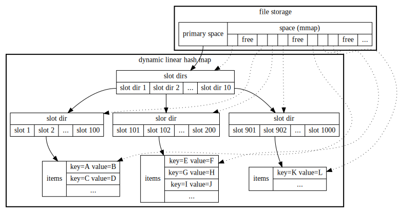

# plainkv

[](https://godoc.org/github.com/roy2220/plainkv) [](https://travis-ci.com/roy2220/plainkv) [](https://codecov.io/gh/roy2220/plainkv)

A simple key-value storage library for Go

## Architecture



## Example

```go
package main

import (
        "fmt"

        "github.com/roy2220/plainkv"
)

func main() {
        func() {
                d, err := plainkv.OpenDict("./test/dict.tmp", true)
                if err != nil {
                        panic(err)
                }
                defer d.Close()

                d.Set([]byte("foo"), []byte("bar"))

                v, ok := d.SetIfNotExists([]byte("hello"), []byte("word"))
                fmt.Printf("%v %q\n", ok, v)

                v, ok = d.SetIfExists([]byte("hello"), []byte("world"))
                fmt.Printf("%v %q\n", ok, v)
        }()

        func() {
                d, err := plainkv.OpenDict("./test/dict.tmp", false)
                if err != nil {
                        panic(err)
                }
                defer d.Close()

                v, ok := d.Get([]byte("foo"))
                fmt.Printf("%v %q\n", ok, v)

                v, ok = d.Clear([]byte("hello"))
                fmt.Printf("%v %q\n", ok, v)

                dc := plainkv.DictCursor{}
                for {
                        k, v, ok := d.Scan(&dc)
                        if !ok {
                                break
                        }
                        fmt.Printf("%q %q\n", k, v)
                }
        }()
        // Output:
        // true ""
        // true "word"
        // true "bar"
        // true "world"
        // "foo" "bar"
}
```
