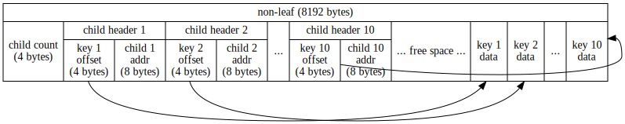

## OrderedDict

An on-disk B+ tree

### Structure





### Example

```go
package main

import (
        "fmt"

        "github.com/roy2220/plainkv"
)

func main() {
        func() {
                od, err := plainkv.OpenOrderedDict("./test/ordereddict.tmp", true)
                if err != nil {
                        panic(err)
                }
                defer od.Close()

                od.Set([]byte("foo"), []byte("bar"), false /* don't return the replaced value */)

                _, ok := od.SetIfNotExists([]byte("hello"), []byte("w0rd"), false /* don't return the present value */)
                fmt.Printf("%v\n", ok)

                v, ok := od.SetIfExists([]byte("hello"), []byte("world"), true /* return the replaced value */)
                fmt.Printf("%v %q\n", ok, v)
        }()

        func() {
                od, err := plainkv.OpenOrderedDict("./test/ordereddict.tmp", false)
                if err != nil {
                        panic(err)
                }
                defer od.Close()

                for it := od.RangeAsc(plainkv.MinKey, plainkv.MaxKey); !it.IsAtEnd(); it.Advance() {
                        k, v, _ := it.ReadRecord()
                        fmt.Printf("%q %q\n", k, v)
                }

                for it := od.RangeDesc([]byte("foo"), plainkv.MaxKey); !it.IsAtEnd(); it.Advance() {
                        k, v, _ := it.ReadRecord()
                        fmt.Printf("%q %q\n", k, v)
                }

                minKey, _ := od.RangeAsc(plainkv.MinKey, plainkv.MinKey).ReadKey()
                maxKey, _ := od.RangeDesc(plainkv.MaxKey, plainkv.MaxKey).ReadKey()
                fmt.Printf("%q...%q\n", minKey, maxKey)

                v, ok := od.Test([]byte("foo"), true /* return the present value */)
                fmt.Printf("%v %q\n", ok, v)

                v, ok = od.Clear([]byte("hello"), true /* return the removed value */)
                fmt.Printf("%v %q\n", ok, v)
        }()
        // Output:
        // true
        // true "w0rd"
        // "foo" "bar"
        // "hello" "world"
        // "hello" "world"
        // "foo" "bar"
        // "foo"..."hello"
        // true "bar"
        // true "world"
}
```
